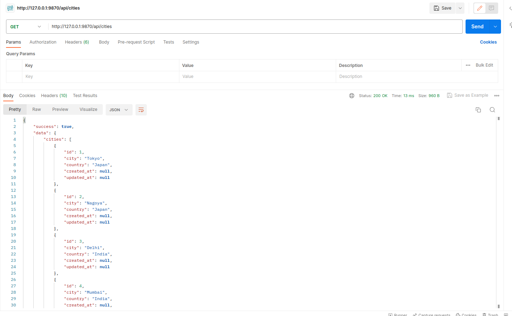
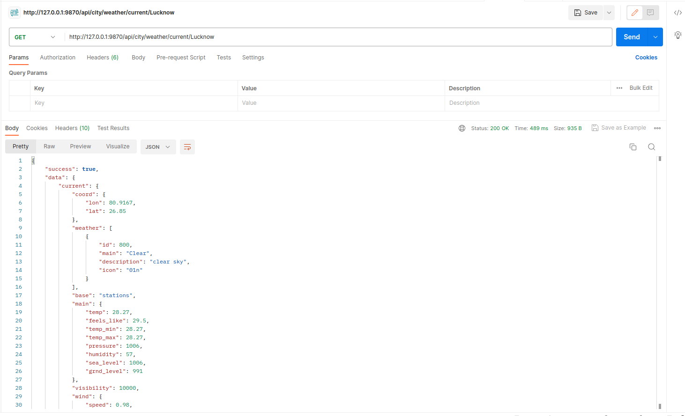
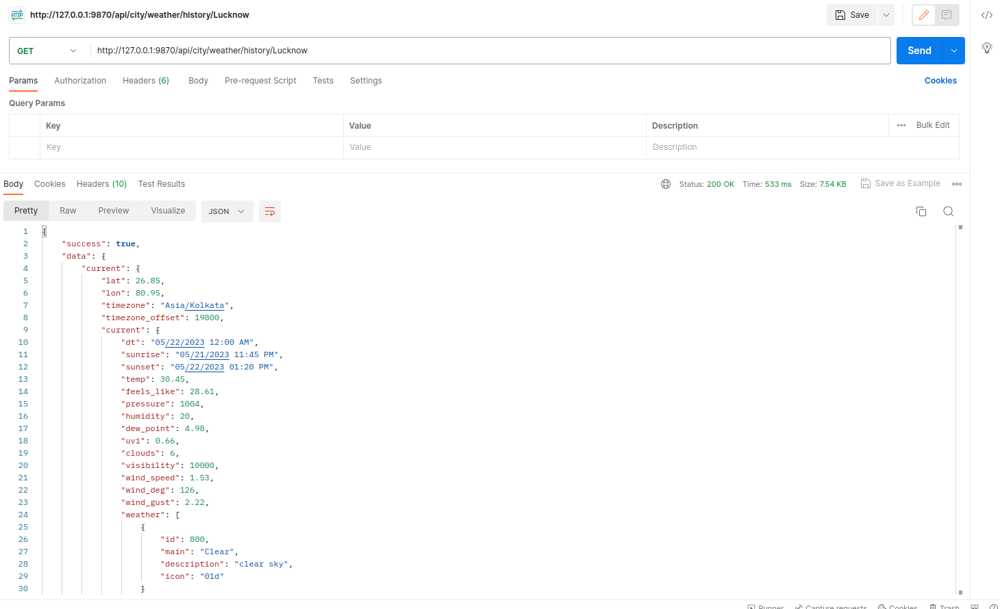
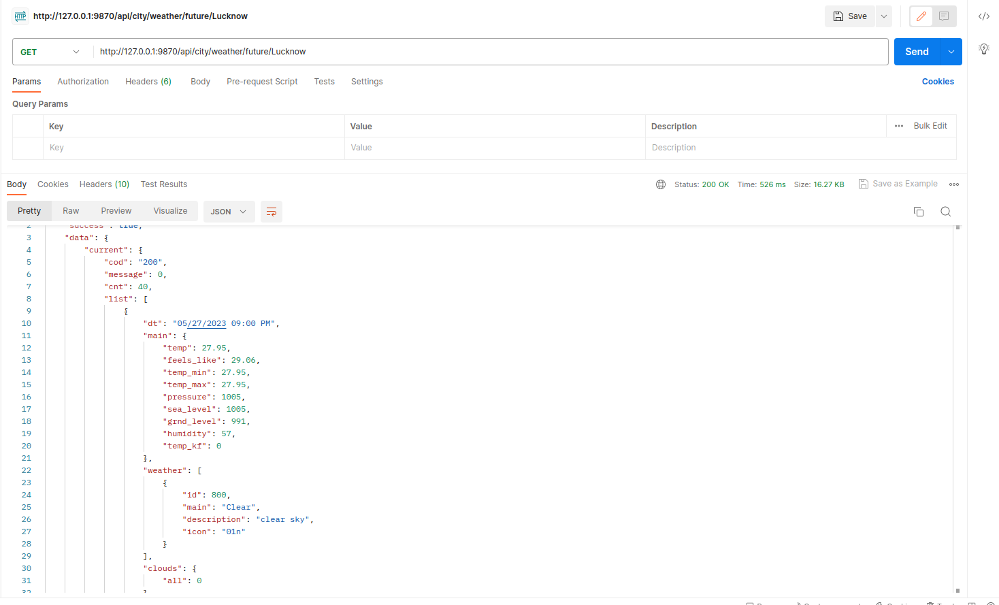
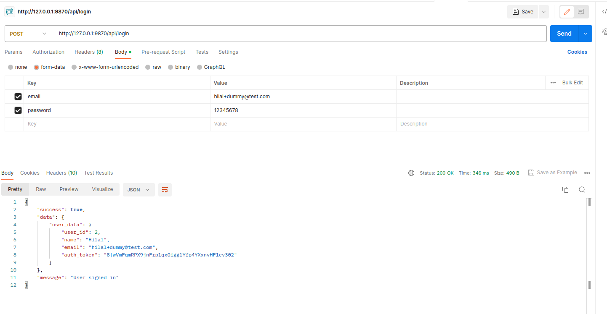
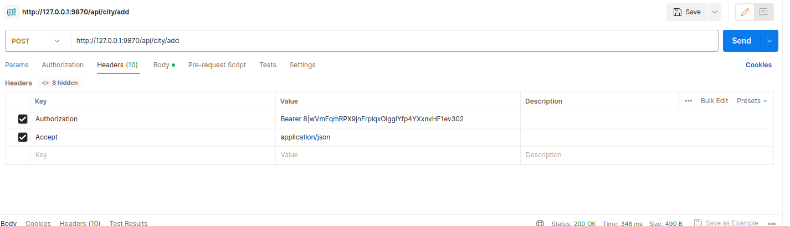
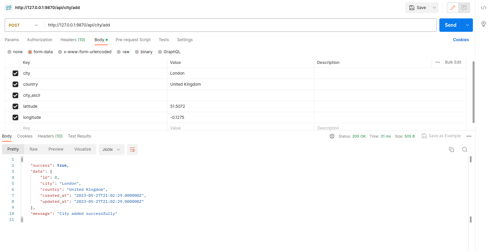

# Get Weather powered by Laravel

## Installation

``` bash
# clone the repo
$ git clone git@bitbucket.org:HilalLko/openweathermap.git get-weather

# go into app's directory
$ cd get-weather

# install app's dependencies
$ composer install

# install app's dependencies
$ npm install

```
### Configure you env

### If you choice to use MySQL

Copy file ".env.example", and change its name to ".env".
Then in file ".env" complete this database configuration:
* DB_CONNECTION=mysql
* DB_HOST=127.0.0.1
* DB_PORT=3306
* DB_DATABASE=laravel
* DB_USERNAME=root
* DB_PASSWORD=

### Set APP_URL

> If your project url looks like: example.com/sub-folder 
Then go to `get-weather/.env`
And modify this line:

* APP_URL = 

To make it look like this:

* APP_URL = http://example.com/sub-folder


### Next step

``` bash
# in your app directory
# generate laravel APP_KEY
$ php artisan key:generate

# generate mixing
$ npm run dev
```

### Next step

```
Add API key and desired language in `.env`
```
OPENWAETHER_API_KEY=
OPENWAETHER_API_LANG=en
```

## Usage

``` bash
# start local server
$ php artisan serve

# test
$ php vendor/bin/phpunit
```

# To get List of All Available Cities 
```
{BASE_URL}/api/cities
```
Sample Output
<p align="center"></p></br>

# To get Current Weather Forecast 
```
{BASE_URL}/api/city/weather/current/{city}
```
Sample Output
<p align="center"></p></br>

# To get Previous Weather History (5days) Forecast 
```
{BASE_URL}/api/city/weather/history/{city}
```
Sample Output
<p align="center"></p></br>

# To get Future (4 days) Weather Forecast 
```
{BASE_URL}/api/city/weather/future/{city}
```
Sample Output
<p align="center"></p></br>

## Some future are intended to only authenticated user

# To get authenticated/login
```
{BASE_URL}/api/login
```
Sample Output
<p align="center"></p></br>

# To add a new city
```
{BASE_URL}/api/city/add
```
Sample Request Header
<p align="center"></p></br>
Sample Output
<p align="center"></p></br>
